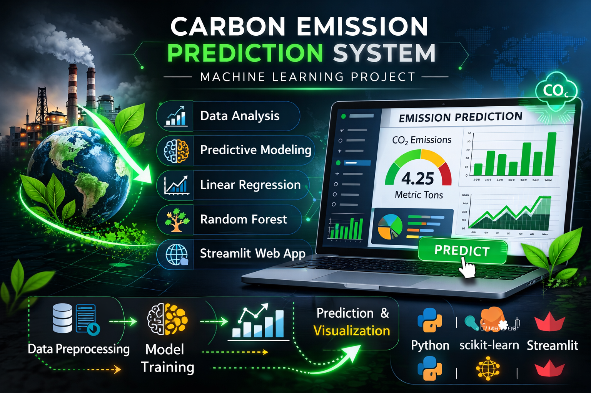

# **🌍 Carbon Emission Prediction – Industry (India)**

---

## **📌 Project Overview**

This project is a Machine Learning–based web application developed using Streamlit to predict industrial carbon emissions (tCO₂/year).  
It helps industries analyze how energy usage, production, fuel efficiency, and sustainability factors impact carbon emissions.  

The system uses Linear Regression and Random Forest Regression models to deliver highly accurate predictions and interactive visual insights.  

---

## **🎯 Objectives**

- Predict carbon emissions for different industries  
- Compare performance of Linear Regression and Random Forest  
- Visualize feature importance using colorful graphs  
- Provide real-time prediction using sliders  
- Allow users to download prediction results  

---

## **🧠 Machine Learning Models Used**

| Model | Purpose |
|-------|---------|
| Linear Regression | Baseline regression model |
| Random Forest Regressor | Captures non-linear emission patterns |

---

## **📊 Model Accuracy (R² Score)**

- Linear Regression: 0.9999999999998932  
- Random Forest: 0.9976454338721412  

---

## **📂 Dataset Description**

The dataset includes industrial and energy-related parameters:

| Feature | Description |
|---------|-------------|
| Industry_Type | Type of industry |
| Energy_Consumption | Energy usage (GWh) |
| Production_Output | Production in tons |
| Fuel_Efficiency | Efficiency (%) |
| Operating_Hours | Annual operating hours |
| Renewable_Usage | Renewable energy (%) |
| Carbon_Capture | Carbon capture efficiency (%) |
| Carbon_Emissions | Target variable (tCO₂/year) |

---

## **🛠 Data Preprocessing**

- Converted categorical data using Label Encoding  
- Split features (X) and target (y)  
- Prepared clean, ML-ready dataset  

✔ Preprocessing completed successfully inside the app  

---

## **🤖 Model Training**

- Both models trained using the same dataset  
- Random Forest chosen for final prediction due to better generalization  
- Feature importance extracted from Random Forest  

---

## **🌈 Feature Importance Visualization**

- Displays relative impact of each feature  
- Uses multi-color (rainbow) bar chart  
- Helps identify major emission contributors  

### **📌 Top Influencing Factors:**

- Energy Consumption  
- Production Output  
- Operating Hours  

---

## **🖥 Web Application Features**

- 📂 Dataset preview  
- 🎚 Interactive sliders for user input  
- 📈 Real-time emission prediction  
- 🌈 Colorful feature importance graph  
- 📥 Download prediction results as CSV  
- ✅ Success messages for actions  

---

## **🚀 Technologies Used**

- Python  
- Streamlit  
- Pandas, NumPy  
- Matplotlib  
- Scikit-learn  

---

## **📦 Project Structure**

Carbon-Emission-Prediction/
│
├── app.py
├── requirements.txt
├── README.md
└── carbon_emission_prediction.csv


---
---

## **▶ How to Run the Project**

```bash
pip install -r requirements.txt
streamlit run app.py
```


--- 
## **💻 Usage Example**

1. Upload dataset or use default CSV
2. Adjust sliders for Energy, Production, Fuel Efficiency, etc.
3. Click **Predict** to see carbon emissions
4. Download results if needed


--- 
## **🎓 Academic Use**

* Suitable for Mini Project / Major Project
* Covers ML + Data Visualization + Deployment
* Ideal for viva and demonstrations

---

## **🧠 Interpretation & Insights**

* Linear Regression shows near-perfect fit on small datasets
* Random Forest captures real-world non-linear behavior
* Sustainability measures significantly reduce emissions

---

## **🔮 Future Scope**

* Integrate other ML models like XGBoost or LightGBM
* Add country-specific emission benchmarks
* Enable user authentication for multiple industry profiles
* Deploy as a cloud app for global access

---

## **🌟 Conclusion**

This project demonstrates how Machine Learning can support environmental sustainability by enabling industries to monitor and reduce carbon emissions effectively.


## **👨‍🎓 Submitted By**

**DARSANA.A**

